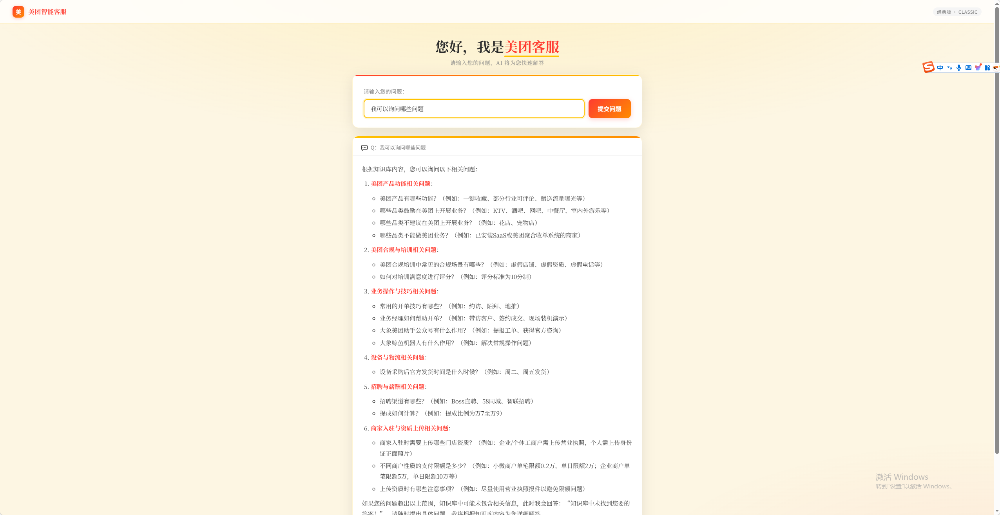

# 美团智能客服系统（测试版）

基于 [RAGFlow](https://github.com/infiniflow/ragflow) 知识库检索引擎，结合 Flask 后端与 SSE 流式推送，构建的美团场景智能问答客服系统。

---

## 项目结构

```
meituan_legacy/
├── chat_un_stream.py     # RAGFlow API 封装模块（非流式问答、公共请求头）
├── websocket_server.py   # Flask 后端服务（提供 HTTP 接口与流式转发）
├── chat.html             # 前端聊天页面（SSE 流式渲染，Markdown 支持）
├── start_service.bat     # Windows 一键启动脚本
└── README.md             # 项目说明文档
```

---

## 功能特性

- **流式回答**：通过 SSE（Server-Sent Events）将 RAGFlow 的流式响应实时推送至前端，打字机效果呈现
- **会话管理**：服务启动时自动初始化全局 Session，后续对话复用同一会话上下文
- **Markdown 渲染**：前端使用 [marked.js](https://marked.js.org/) 对回答内容进行富文本渲染
- **自动重试**：HTTP 请求配置指数退避重试策略，应对 5xx 服务异常
- **备用接口**：同时提供非流式 `/ask` 接口，便于调试与兼容
- **响应式布局**：前端页面适配桌面与移动端

---

## 环境要求

- Python 3.8+
- 已部署并运行中的 RAGFlow 实例（本地或远程）
- Windows 系统（一键启动脚本）或任意支持 Python 的平台

---

## 安装依赖

```bash
pip install flask requests
```

---

## 配置说明

在 `chat_un_stream.py` 中修改以下配置项：

```python
# RAGFlow 服务地址（默认本地）
BASE_URL = "http://localhost//api/v1"

# 你的 RAGFlow API 密钥
API_KEY = "ragflow-xxxxxxxxxxxxxxxxxxxxxxxx"

# 目标对话助手的 Chat ID
CHAT_ID = "xxxxxxxxxxxxxxxxxxxxxxxxxxxxxxxx"
```

> **模块说明**：`chat_un_stream.py` 同时提供 `_auth_headers()` 公共函数，供 `websocket_server.py` 复用，无需在多处重复构造请求头。

> **如何获取 Chat ID？**  
> 登录 RAGFlow 管理后台 → 进入「对话」模块 → 选择或创建一个助手 → URL 中的末段即为 Chat ID。

---

## 启动服务

### 方式一：双击一键启动（Windows）

直接双击 `start_service.bat`，脚本将自动：
1. 启动 Flask 后端服务（端口 `5050`）
2. 打开浏览器访问 `http://localhost:5050`

### 方式二：命令行启动

```bash
python websocket_server.py
```

服务启动后访问：[http://localhost:5050](http://localhost:5050)

---

## 接口文档

### `POST /ask` — 非流式问答

**请求体**
```json
{
  "question": "如何申请退款？"
}
```

**响应**
```json
{
  "answer": "您可以在订单详情页点击【申请退款】按钮……"
}
```

---

### `POST /ask_stream` — 流式问答（SSE）

**请求体**
```json
{
  "question": "如何寻找合适的门店？"
}
```

**响应**：`text/event-stream` 格式，逐块推送
```
data: {"answer": "您可以"}
data: {"answer": "您可以通过"}
data: {"answer": "您可以通过美团 App……"}
data: [DONE]
```

---

## 注意事项

1. **SSL 验证已禁用**：当前代码对 RAGFlow 的请求设置了 `verify=False`，适用于本地或内网自签名证书环境。生产环境建议配置正式证书并移除该选项。
2. **单一全局会话**：后端使用共享 `session_id`，所有用户共用同一对话上下文。如需多用户隔离，需改造为每用户独立 Session 的管理方案。
3. **RAGFlow 服务依赖**：本系统为 RAGFlow 的前端封装，需确保 RAGFlow 服务正常运行且 API 可访问。

---

## 技术栈

| 层级 | 技术 |
|------|------|
| 前端 | HTML / CSS / JavaScript · marked.js · SSE |
| 后端 | Python · Flask · Requests |
| AI 引擎 | RAGFlow（知识库检索增强生成） |
| 通信协议 | HTTP REST · Server-Sent Events (SSE) |

---

## 运行截图

### 截图




> 将截图保存到项目根目录下的 `screenshots/` 文件夹，并按上方文件名命名即可自动显示。

---

 这是示例网址：frp-era.com:62150（此网址为使用内网穿透得到的网址，仅用于学习）
 
---
## License

本项目为内部测试版本，仅供参考学习使用。
